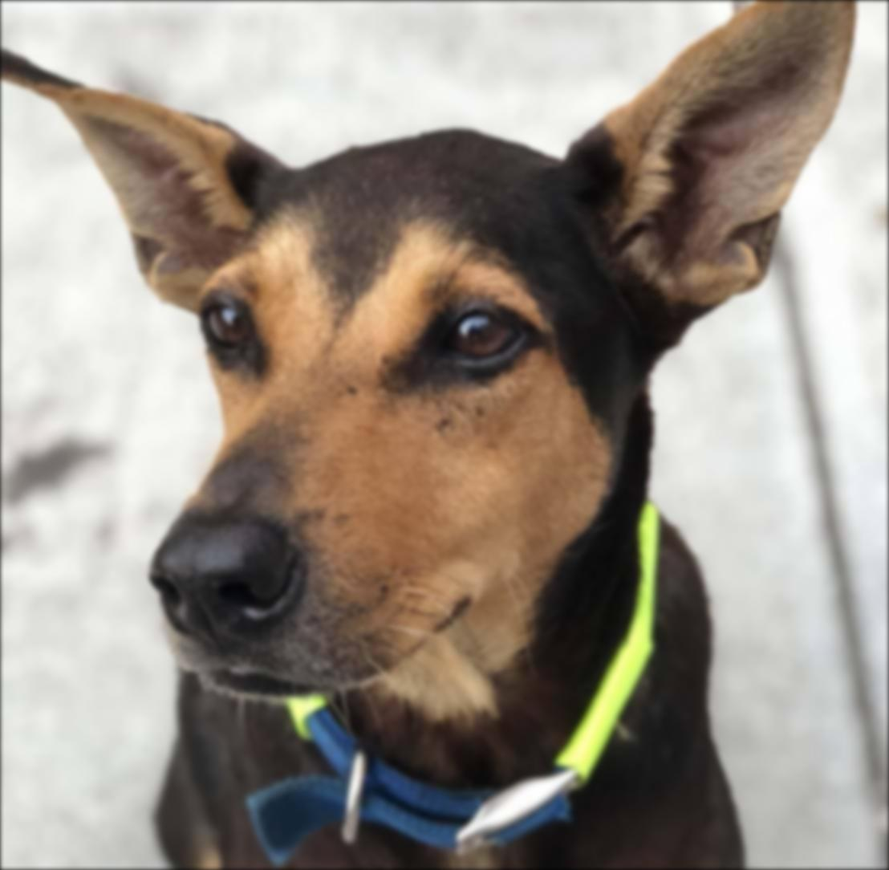
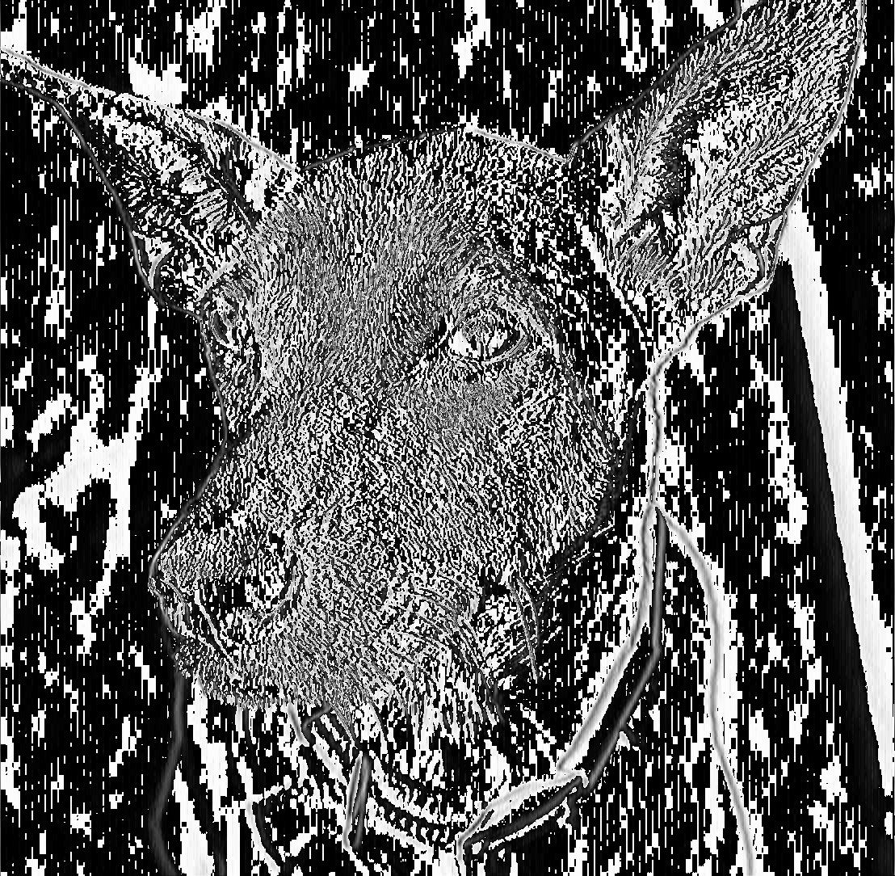

# Expert-Doodle
Expert-Doodle is **real-time image processing Python GUI application**. It's optimized by hardware acceleration that uses OpenCL, and you can run on all your systems.

## Contents
1. [How it looks](#how-it-looks) - have a look at it
2. [Quick Start](#quick-start) - try it on your systems
3. [How it works](#how-it-works) - high level diagram of how it works
4. [Methods](#methods) - implementation details
5. [Future Works](#future-works) - milestone for this project
5. [Reference](#reference) - documents refered in development

## How it looks
The following animated image, shows the main dashboard.


## Quick Start

### Auto install script
* Copy the command and paste in your terminal console
```shell
sh -c "$(wget https://raw.githubusercontent.com/jackyhuang85/expert-doodle/master/install.sh -O -)"
```


### Manual Install
1. Install packages
    * opencv 
        * `$ conda install opencv`
    * pyopencl 
        * `$ conda install -c conda-forge pyopencl`
    * gputools 
        * `$ pip install gputools`
2. Clone this repository
    * `$ git clone https://github.com/jackyhuang85/expert-doodle.git`
3. Enter the directory and run Python script
    * `$ cd expert-doodle/src`
    * `$ python main.py`

## How it works
Expert-Doodle is a simply, elegant, real-time image processing demostration side-work.


```
├── README.md
├── example
├── requirement.txt
└── src
    ├── camera.py
    ├── controller.py
    ├── filters.py
    ├── main.py
    ├── test_filter.py
    └── views.py
```
| Part   	| Description 	| File 	|
|------------	|:------------	|------	|
| **Views**      	|This Python GUI app is implemented with PyQt5 library.	It describes the appearance and layout where the output frame is displayed.|src/views.py      	|
| **Controller** 	|Handle events triggered by user interacting, camera frame processing.             	| src/controller.py     	|
| **Camera**     	|Declare methods handling raw data captured by camera device.             	| src/camera.py     	|
| **Filters**    	|Define image processing filter functions.             	|src/filters.py      	|


## Implementation
### Filters
We implement some kind of fundamental image processing methods to provide basic effect on image.

For example, the original image is


#### gray scale
The gray scale image is calculated by 

``` python
gray_scale = 0.299*R + 0.587*G + 0.114*B
```


#### blur
The image convolves with a gaussian kernel to form a blurred image with a tunable kernel size and sigma.

```python
blurred = convolve(image, gaussian_kernel)
```



#### sharpen
The sharpen method is done by subtracting the original image by its blurred image with a tunable *rate* to control the sharpness.

```python
sharpened = (1+rate) * image - rate*blurred
```


#### invert
The image is simply subtracted by the max value of the image.

```python
inverted = 255 - image
```


#### power
Each value of the image powers itself by a tunable *rate*.

```python
powered = image**(2-rate)
```


#### sobel
The sobel filter calculates the differences between a 3 by 3 kernel and get the gradient of the gray scale image.

```python
sobel_matrix_x = [[-1, 0, 1],
                  [-1, 0, 1],
                  [-1, 0, 1]]
sobel_matrix_y = [[1, 2, 1],
                  [0, 0, 0],
                  [-1, -2, -1]]
sobel_image_x = convolve(gray_scale, sobel_matrix_x)
sobel_image_y = convolve(gray_scale, sobel_matrix_y)
```



#### edge detect
This method is implemented by calculating gradient of x and y direction. Then we calculate the magnitude of the gradients.

```python
gx = sobel_image_x
gy = sobel_image_y
edge = sqrt((gx**2)+(gy**2))
```


### Performance
Initially, all computations are done in CPU (no OpenCL supported), then FPS <span style='color: red'>got only 10% </span>compared to the present version.

Due to heavy burst on **matrix computation**, we addressed the problem with OpenCL library that enables hardware acceleration(GPU). 

In addition, both **sharpen** and **blur** involve [Gaussian kernel], **we forsake the built-in [gaussian filter function provided by SciPy]**, which causes the low performance. Instead, we design the gauss2D function to generate the kernel.

The following table shows how much performance improves after optimization.

|Filters    |Before   |After  |
|---------- |---------|-------|
|Gray Scale |10       |26     |
|Invert     |12       |28     |
|Blur       |0.1      |16     |
|Edge Detect|0.7      |18     |

## Future Works

- [x] Linux support
- [x] OpenCL support
- [x] Mac OS support
- [ ] Windows support (testing)
- [ ] Improve performance
- [ ] Live streaming output on Youtube

## Reference

* [PyOpenCL](https://documen.tician.de/pyopencl/)
* [maweigert/gputools](https://github.com/maweigert/gputools)

[Gaussian kernel]:https://en.wikipedia.org/wiki/Gaussian_blur
[gaussian filter function provided by SciPy]:https://docs.scipy.org/doc/scipy/reference/generated/scipy.ndimage.gaussian_filter.html
